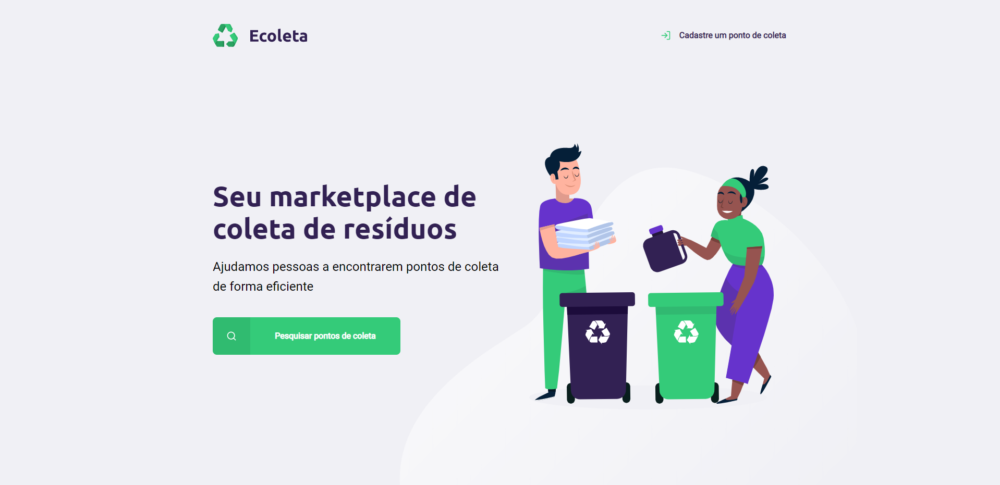
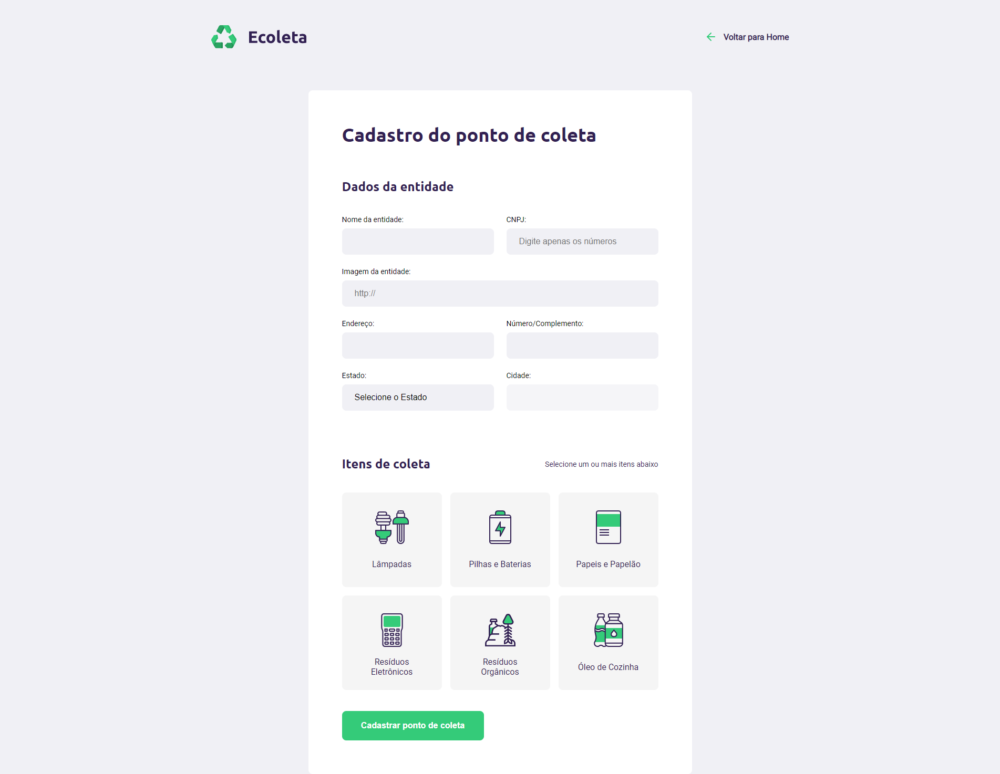
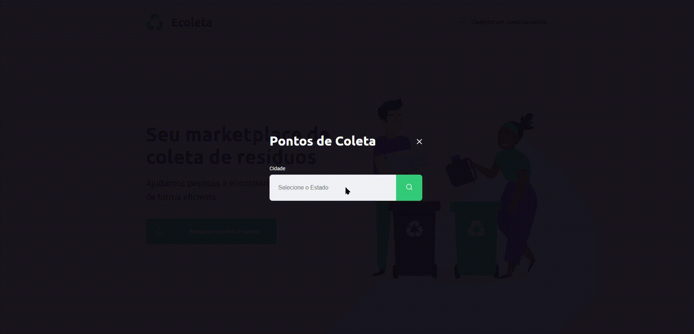
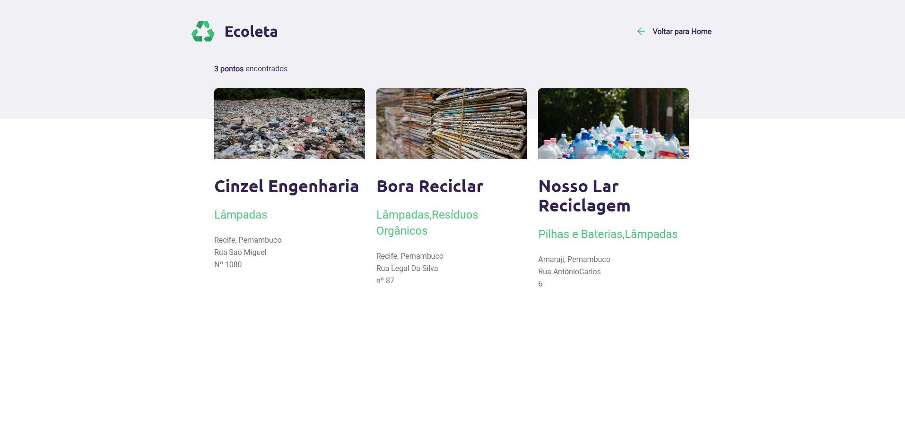

# ecoleta-next-level-week :rocket:
 Repositório responsável por armazenar o projeto desenvolvido durante a semana **Next Level Week#1** promovida pela *Rocketseat*.

 ## Ecoleta :recycle:

 Pensado na semana do meio ambiente, o ecoleta é uma aplicação onde une quem deseja descartar diversos tipos de dejetos de forma consciente, com instituições que prestam esse tipo de serviço. Na aplicação a instituição faz o cadastro com as suas informações e os tipos de itens que coletam. O usuário pode pesquisar essas instituições por estado, ou se preferir, pesquisar sem filtro nenhum.

 

 

 

 

## Tecnologias utilizadas :computer:

* Front-end: 
   * Html
   * Css
   * JavaScript

* Back-end:
   * Node
   * Sqlite3
   * Nunjucks

## Como rodar :fire:

1. Clone o repositório
1. Execute o comando `npm install` para instalar todas as dependências
1. Execute o comando `npm start` para iniciar o servidor
1. Abra o navegador no endereço `http://localhost:3000`

###### Com amor :heart: Samuel Santos

